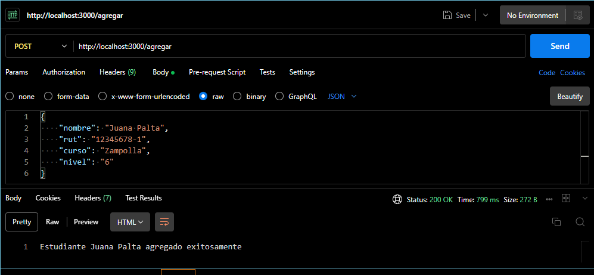
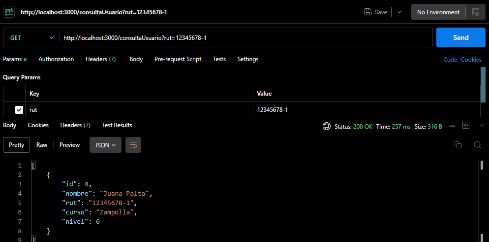
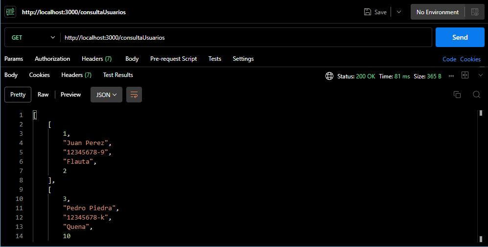
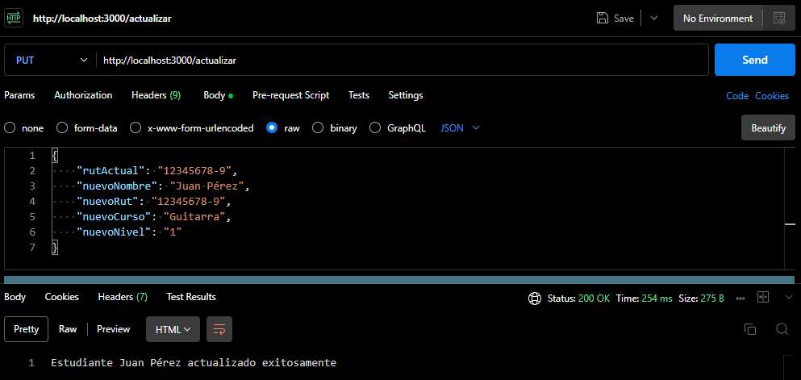
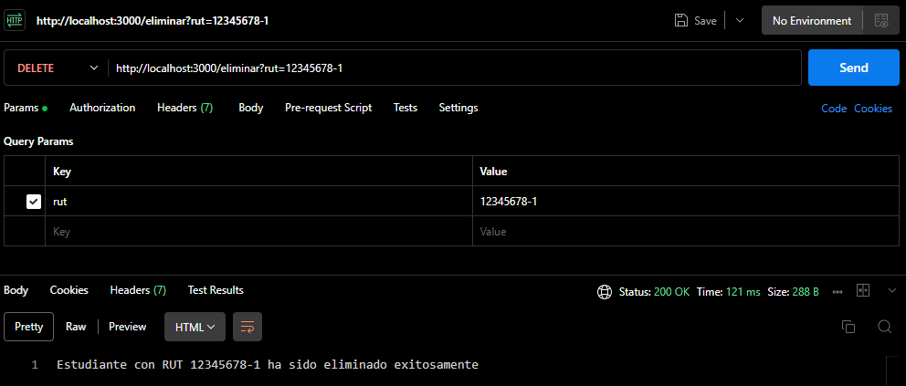

# Desafío Evaluado, Modulo VII - Always Music 2.

## Descripción del proyecto

Validación conocimientos de Consultas con texto parametrizado, JSON como argumento de una consulta, Captura de errores.

## Prerrequisitos o Dependencias
- Windows, Mac, Linux.
- Javascript, PostgreSQL, Node.js.
- Visual Studio Code.
- PGAdmin.
- Postman

### Para inicializar el programa se requiere:

1. Instalar las dependencias Express, PG y DOTENV usadas con el comando `npm i express pg dotenv`.
2. Se requiere crear una database en postgres usando las consultas en la carpeta SQL.
3. Crear un archivo `.env` con las variables de entorno necesarias (DB_USER, DB_PASSWORD, DB_HOST, DB_DATABASE).

### Ejemplo de uso en Postman

Agregar Usuario:

Consultar Usuario por RUT:

Consultar Usuarios:

Actualizar Usuario:

Eliminar Usuario por RUT:

## Licencia

Este proyecto está bajo la Licencia MIT - ve el archivo [LICENSE.md](LICENSE) para detalles

---

## Eric Arancibia (https://github.com/ericarancibia) - G68 Desarrollo Aplicaciones Full Stack JavaScript. Talento Digital - Academia Desafío Latam